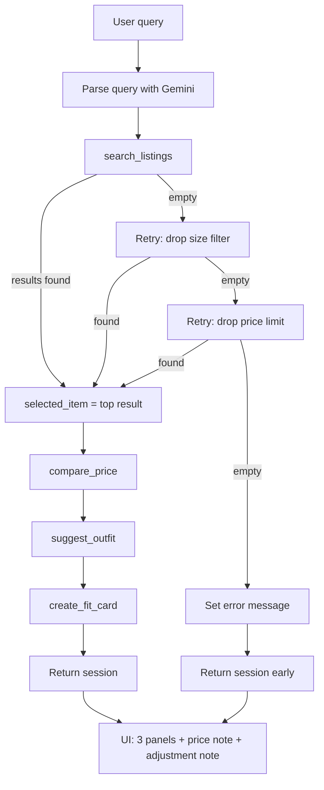

# FitFindr


FitFindr is a multi-tool AI agent that helps you find secondhand clothing and figure out how to wear it. You describe what you're looking for in plain language — including size and budget if you want — and the agent searches a listings dataset, suggests outfits using your wardrobe, and writes a shareable caption for the find. It runs as a Gradio web app.

The agent doesn't run a fixed script. It decides what to do based on what each step returns: if the search finds nothing, it loosens the filters and tries again before giving up, and it never passes empty results into the steps that follow.

---

## How to run it

```bash
pip install -r requirements.txt
```

Add your Gemini API key to a `.env` file in the project root (this file is gitignored — don't commit it):

```
GEMINI_API_KEY=your_key_here
```

Get a free key at https://aistudio.google.com/apikey.

Then start the app:

```bash
python app.py
```

Open the URL printed in the terminal (usually http://localhost:7860). You can also run the agent from the command line without the UI:

```bash
python agent.py
```

---

## Tool inventory

The agent uses four tools. Three are required; `compare_price` is a stretch feature.

### `search_listings(description, size, max_price)`

**Inputs:** `description` (str) — keywords like "vintage graphic tee". `size` (str or None) — a size to filter by, matched case-insensitively so "M" matches "S/M". `max_price` (float or None) — an inclusive price ceiling.

**Returns:** A list of listing dicts sorted by relevance, best match first. Each dict has `id`, `title`, `description`, `category`, `style_tags`, `size`, `condition`, `price`, `colors`, `brand`, and `platform`. Returns an empty list when nothing matches — it never raises.

**Purpose:** Finds candidate items. It filters by price and size first, then scores the remaining listings by how many words from the description appear in the listing's text, drops anything that scores zero, and sorts the rest.

### `suggest_outfit(new_item, wardrobe)`

**Inputs:** `new_item` (dict) — the listing the user is considering. `wardrobe` (dict) — has an `items` key holding a list of wardrobe pieces, which may be empty.

**Returns:** A string with one or two outfit suggestions. When the wardrobe has items, the suggestions name specific pieces from it. When the wardrobe is empty, it returns general styling advice for the item instead.

**Purpose:** Turns a found item into wearable outfit ideas grounded in what the user already owns. This tool calls the Gemini model.

### `create_fit_card(outfit, new_item)`

**Inputs:** `outfit` (str) — the suggestion string from `suggest_outfit`. `new_item` (dict) — the listing, used for the item name, price, and platform.

**Returns:** A short, casual caption (2–4 sentences) that reads like a real outfit post. It mentions the item name, price, and platform once each and varies between runs.

**Purpose:** Produces the shareable end product. This tool calls the Gemini model with a higher temperature so captions don't repeat.

### `compare_price(item)` — stretch

**Inputs:** `item` (dict) — a listing, using its `category` and `price`.

**Returns:** A dict with `assessment` ("good deal", "fair", "overpriced", or "insufficient data"), `item_price`, `median_comp`, `comp_count`, and a one-sentence `reasoning`.

**Purpose:** Tells the user whether the price is fair by comparing it to other listings in the same category. It's pure dataset math with no model call. An item priced at or below 85% of the category median is a "good deal"; at or above 115% it's "overpriced"; otherwise "fair". If there are fewer than two comparable listings, it returns "insufficient data" instead of guessing.

---

## How the planning loop works

The loop lives in `run_agent()` in `agent.py`. It runs the tools in order, but the order is not fixed — it branches on what the search returns. Here is the conditional logic, step by step:

1. **Parse the query.** The raw text ("vintage graphic tee under $30, size M") goes to the Gemini model, which extracts a `description`, `size`, and `max_price`. If parsing fails, the agent falls back to using the whole query as the description with no size or price filter.

2. **Search, and branch on the result.** The agent calls `search_listings` with the parsed values, then checks whether the result list is empty.
   - **If it found something**, it takes the top result and continues.
   - **If it found nothing**, it does not stop yet. It retries with the size filter removed. If that still finds nothing, it retries again with the price ceiling also removed. Each time it loosens a filter, it records what it changed. Only if all three attempts fail does it set an error message and stop — it never calls the outfit or caption tools with an empty result.

3. **Assess the price** of the selected item with `compare_price`, and store the result.

4. **Suggest an outfit** from the selected item and the wardrobe.

5. **Write the fit card** from the outfit and the item.

The key decision point is step 2. Whether the agent proceeds, retries, or stops depends entirely on what the search returned — that's what makes it a planning loop rather than a fixed sequence.

### What happens when the search finds nothing

This is the most important branch, so it's worth stating plainly. When `search_listings` returns an empty list, the agent:

1. Retries with the size filter dropped, and notes "removed size filter".
2. If still empty, retries with the price ceiling also dropped, and notes "removed price limit".
3. If still empty after both, sets the error: *"No listings matched even after removing the size and price filters. Try a different description."* and returns without calling the remaining tools.

In testing, the query "graphic tee size XXS" had no exact match (no tee exists in XXS), so the agent removed the size filter, retried, and recovered the closest match — returning the item with `adjustments: ['removed size filter']` and no error. The query "designer ballgown size XXS under $5" had no match at any size or price, so it loosened both filters, still found nothing, and returned the error message.

---

## State management

All state for one interaction lives in a single `session` dictionary created at the start of `run_agent()` and passed through every step. Nothing is stored globally, and the user never re-enters anything between steps.

| Field | Written when | Read by |
|-------|-------------|---------|
| `query` | at start | query parser |
| `parsed` | after parsing | `search_listings` |
| `search_results` | after search | the empty-result check |
| `selected_item` | after a successful search | `compare_price`, `suggest_outfit`, `create_fit_card` |
| `adjustments` | when a retry loosens a filter | the UI, to tell the user what changed |
| `price_assessment` | after `compare_price` | the UI |
| `wardrobe` | at start | `suggest_outfit` |
| `outfit_suggestion` | after `suggest_outfit` | `create_fit_card` |
| `fit_card` | after `create_fit_card` | the UI |
| `error` | if the search fails after retries | the UI |

The thing that ties the tools together is `selected_item`. It holds the full listing dict from the search, so the outfit step and the caption step both work from the exact item the search found — the user never re-describes it. For example, the $18 price and "depop" platform shown in the search result flow straight into the fit card caption without being re-entered anywhere.

---

## Error handling

Each tool handles its own failure so one broken step doesn't take down the whole agent.

| Tool | Failure mode | What the agent does |
|------|-------------|--------------------|
| `search_listings` | No listing matches | Returns an empty list. The planning loop catches this and retries with looser filters before reporting failure. |
| `suggest_outfit` | The wardrobe is empty | Returns general styling advice for the item instead of crashing on the empty list. |
| `suggest_outfit` | The model call raises | Returns the string *"Couldn't generate outfit suggestions right now. Try describing your wardrobe and I can help manually."* |
| `create_fit_card` | The outfit string is empty | Returns *"Unable to generate a fit card — outfit description was missing."* without calling the model. |
| `create_fit_card` | The model call raises | Returns the outfit suggestion with a note that the caption failed, so the user still gets something usable. |
| `compare_price` | Fewer than two comparable listings | Returns an "insufficient data" result instead of a misleading assessment. |

**A concrete example from testing.** Calling `create_fit_card("", item)` with an empty outfit returned *"Unable to generate a fit card — outfit description was missing."* exactly — no model call, no exception. And `compare_price` on an item in a category with no other listings returned `{"assessment": "insufficient data", "median_comp": None, "comp_count": 0, ...}`. The live 40-listing dataset never actually triggers the insufficient-data branch, because every real category leaves at least two comparables after excluding the item itself, so that branch was confirmed with a forced test case.

---

## Architecture



---

## Spec reflection

**One way the spec helped.** Writing the tool signatures and failure modes in `planning.md` before any code meant each Copilot prompt was a near-direct copy of a spec block. The tools came out matching their intended interfaces on the first or second try because the inputs, return shapes, and failure behavior were already decided. The error-handling table in particular turned into the implementation almost line for line.

**One way the implementation diverged, and why.** The plan assumed a working Gemini model and didn't account for quota. In practice, `gemini-2.5-flash` has a 20-request-per-day free-tier limit, which the build hit during testing — every model call started returning the fallback strings even though the code was correct. The fix was switching to `gemini-2.5-flash-lite`, which has far more daily headroom. A second smaller divergence: the plan had the outfit and caption tools self-handle their errors by returning fallback strings, but the agent loop also wraps them in try/except as a safety net. Since the tools don't raise, the net never fires — it's redundant, but harmless, and it means an unexpected failure still can't crash the run.

---

## AI usage

I used GitHub Copilot as the implementer and a separate AI assistant as the architect, working one component at a time.

**Instance 1 — implementing `search_listings`.** I gave Copilot the Tool 1 spec block from `planning.md`: the parameter names and types, the scoring rule (count description words appearing in the listing text), and the requirement to return an empty list rather than raise. Copilot produced the function. I reviewed it against the spec and tested three cases: a query that should return results, an impossible query that should return `[]`, and a price-filter check. The price check is the one I specifically verified, because a common mistake is using `<` instead of `<=` for the inclusive ceiling — Copilot got it right, and the test confirmed every returned item was at or under the limit.

**Instance 2 — debugging truncated model output.** The first outfit suggestions came back cut off mid-sentence. I diagnosed that `gemini-2.5-flash` spends part of its output budget on internal "thinking" tokens, which left too few tokens for the visible answer. I directed Copilot to add `thinking_config=types.ThinkingConfig(thinking_budget=0)` to the model config so the full token budget went to the response, and applied the same fix to the caption tool. After the change, both tools returned complete output. This was a case where I overrode the default model behavior rather than accepting the first result.

**Instance 3 — the retry branch.** I gave Copilot the retry pseudocode and the existing `run_agent()`, with explicit instructions not to change the working happy path. I reviewed the generated code to confirm it only retried on empty results, tracked each loosened filter in the session, and still exited cleanly when all retries failed. I then tested all three paths — happy path unchanged, a size-only failure that recovered, and a total failure that reported what it adjusted — before committing.